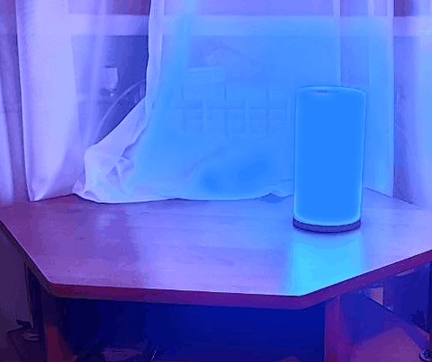

# Claude Code Status Lamp 🚦

**English** · [Русский](README.ru.md)



**Glance at a lamp instead of babysitting the terminal.** This turns a [WLED](https://github.com/wled/WLED) lamp — including a reflashed [GyverLamp](https://github.com/AlexGyver/GyverLamp) — into an ambient status light for [Claude Code](https://claude.com/claude-code).

The real feature isn't "blue means working." It's **amber = Claude needs *you***. Drop into your own task, look away from the screen, and let the lamp call you back the moment Claude is blocked on a permission or a question. If you hyperfocus, that's the whole point: get your attention back without staring at the terminal waiting for it to need you.

- 🔵 **Blue** — Claude is working
- 🟡 **Amber** — Claude needs you (a permission, or waiting on your input)
- 🟢 **Green** — idle, your turn
- 🔴 **Red** — a turn failed

No polling and no *required* background service — just a tiny standard-library Python script that fires one HTTP request to the lamp from Claude Code's lifecycle hooks. It's **fail-silent**: lamp offline or on another network → the hook does nothing and never blocks Claude. *(An optional [background daemon](#background-daemon-optional) re-evaluates on a timer — handy if `idle_prompt` doesn't always reach you — and is the basis for per-agent zones. The hooks-only setup below needs no daemon at all.)*

## How it works

Claude Code [hooks](https://code.claude.com/docs/en/hooks) run a shell command on lifecycle events. Each event calls `lamp_status.py <state>`, which POSTs `{"ps": N}` to WLED's JSON API to apply a preset:

```
UserPromptSubmit, PreToolUse       ──▶ working    ──▶ preset 1 (blue)
Notification [permission_prompt]   ──▶ attention  ──▶ preset 2 (amber)
Notification [idle_prompt]         ──▶ done       ──▶ preset 3 (green)
SessionStart                       ──▶ done       ──▶ preset 3 (green, resting)
StopFailure                        ──▶ error      ──▶ preset 5 (red)
SessionEnd                         ──▶ off
```

**Why `Stop` is deliberately *not* wired.** `Stop` fires whenever a turn ends — including when Claude launches a background subagent/workflow and is *still working*. Wiring `Stop → green` paints the lamp "done" mid-task (a false green). So green comes from `idle_prompt` (Claude is genuinely idle, waiting for you) and `SessionStart` instead.

The trade-off: **green appears ~60s after the turn ends, not instantly**, because `idle_prompt` fires after a short idle period. That's intentional — we trade instant-green for never-lying-green. (Don't "helpfully" add `Stop → done` back; it reintroduces the false green.)

## Requirements

- **Python 3.6+** — standard library only, no `pip install`. On Windows use `py`, on macOS/Linux `python3`.
- **WLED 0.14+** (tested on 16.x). Older builds may not accept the preset-save API.
- A WLED lamp — any ESP8266/ESP32 + WS2812B you can flash WLED onto — on your LAN.

## Hardware

- Any ESP8266/ESP32 board driving WS2812B (or compatible) LEDs, running **WLED**.
- A **GyverLamp** (AlexGyver's addressable-LED matrix lamp) works great — just reflash it from stock firmware to WLED.
- Needs ≥4 MB flash (the safe floor; 1 MB ESP-01 builds exist but are cramped) and a **2.4 GHz** Wi-Fi network on the same subnet as the machine running Claude Code.

## Setup

### 1. Flash WLED

Use the browser flasher at **[install.wled.me](https://install.wled.me/)** (Chrome/Edge). Pick the build for your chip (ESP8266 or ESP32), tick **Erase**, install. No Arduino IDE needed.

> **Reflashing a GyverLamp?** Connect to the controller board's **own** micro-USB (the case jack is often power-only), use a **data** USB cable (not charge-only), and install the **CP2102 / CH340** driver if no COM port appears.

### 2. Connect the lamp to 2.4 GHz Wi-Fi

Join the `WLED-AP` network (password `wled1234`); the setup page usually pops up automatically — if not, open `http://4.3.2.1`. Enter your home Wi-Fi.

> ⚠️ **The #1 gotcha.** ESP8266 is **2.4 GHz only** and often won't join a **Wi-Fi 6 (802.11ax)** access point. If the lamp won't connect:
> - pick the **2.4 GHz** SSID (not a `*_5G` one);
> - in your router, set the 2.4 GHz band to **802.11 b/g/n** — i.e. look for a **"disable Wi-Fi 6 / 802.11ax"**, **"b/g/n only"**, or **"compatibility"** toggle. It's labelled differently per vendor: **Xiaomi/Redmi** = *Wi-Fi settings → "WiFi 5 compatibility mode"*; **TP-Link/ASUS/Keenetic** = *Wireless mode → b/g/n mixed*;
> - keep encryption on **WPA2-PSK** (ESP8266 doesn't do WPA3).
>
> Note this relaxes that band's security a little — fine on a home network (see [Security](#security)).

### 3. Find the lamp's IP

Check your router's client list, try `http://wled.local`, or scan your subnet. Then pin it with a **DHCP reservation** so the address never changes.

### 4. Create the status presets

Run the init script (replace with your lamp's IP):

```bash
python init_presets.py 192.168.1.50
```

It writes presets **1/2/3/5** and verifies each one. ⚠️ It overwrites those slots — change the numbers in the script if you already use them.

…or restore [`presets.json`](presets.json) in WLED (Config → Security & Backup → Restore presets) — the more reliable path on a slow ESP8266. It also ships an optional preset **4 "Ambient"** (a rainbow scene the hooks never use — keep it as a resting glow or ignore it).

### 5. Set the LED count

WLED → **Config → LED Preferences** → set the LED count to your matrix (e.g. **256** for a 16×16) and the data pin (a GyverLamp uses **GPIO2 / D4** — **check your own board's data pin**). Until you set the count, only part of the matrix lights — that's expected, not a failure. Set the current limit to match your power supply.

### 6. Install the hook script + hooks

- Put `lamp_status.py` somewhere stable. Set the lamp IP via the `WLED_IP` env var, or edit `LAMP_IP` at the top.
- Merge the hooks from [`examples/settings-hooks.json`](examples/settings-hooks.json) into your Claude Code `~/.claude/settings.json`. **Merge** into the existing `hooks` object — don't overwrite it. Replace `<python>` with your launcher (**Windows `py`**, **macOS/Linux `python3`**) and the path.
- Field meanings: **`matcher`** filters which sub-event fires the hook (for `Notification`: `permission_prompt` vs `idle_prompt`; for `PreToolUse`: the tool name, `""` = all tools); **`async: true`** runs the command without blocking the turn; **`timeout`** caps it in seconds.

### 7. Test

Submit a prompt → 🔵 blue. Wait idle ~60s → 🟢 green. Trigger a permission → 🟡 amber.

Nothing happening? Run `/hooks` (or restart Claude Code) so it reloads `settings.json`, then debug the script by hand:

```bash
WLED_DEBUG=1 python lamp_status.py working
```

`WLED_DEBUG=1` prints the traceback (wrong IP, wrong network, presets not created) instead of staying silent.

## Customization

- **Colors / brightness:** edit the RGB + `bri` values in `init_presets.py` (or re-save presets in the WLED app). Blue is on ~95% of the time, so it ships dimmest; amber ships brightest because it's the one that should grab you. Drop the values further for night use.
- **Animated statuses:** a WLED preset can store any effect, not just a solid color — make "working" a slow breathing blue, "attention" a blink. Just re-save the preset with an effect selected.
- **More states:** map other hooks (e.g. `SubagentStop`, `PreCompact`) to extra presets.

## Multiple sessions

Run as many Claude Code sessions as you like against one lamp. Each session's state is tracked by its `session_id` (read from the hook's stdin), and the lamp shows the **highest-priority** state across all live sessions:

> attention (amber) · error (red) · working (blue) · done (green)

So an **amber from *any* session latches the lamp amber** until that session is no longer blocked — a busy or idle session can't paint over "someone needs you." When the last session ends, the lamp turns off. The script also de-dups repeats, so a flurry of `PreToolUse` "working" events sends at most one request.

A session is dropped **the moment its owning process is gone** — the hook records the owner's PID and start-time, and the [daemon](#background-daemon-optional) removes any session whose process has exited (or whose PID was reused). So a hard-closed window or a crash never leaves a dead session lingering on a colour; there's no timeout to wait out. Sessions on a platform where the owner can't be resolved fall back to a 6-hour safety-net TTL.

## Background daemon (optional)

The hooks apply the lamp on every event, so it only re-evaluates *when a hook fires*. If a session finishes and no `idle_prompt` arrives — or a session is killed without a clean `SessionEnd` — its "working" state can linger and hold the lamp blue until some other hook happens to run.

[`lamp_daemon.py`](lamp_daemon.py) closes that gap. It's a small always-on process that re-reads the shared session state on a timer (`LAMP_POLL`, default 5s), treats any "working" session that's been silent past the freshness window as idle, reaps sessions whose process has exited, and paints the lamp — so it settles to green/off on its own, no hook required. It renders with WLED segments (a solid colour across the matrix for one agent, or one band per agent — see [Multiple agents](#multiple-agents-zones)), which makes it the *sole* renderer: run the hooks write-only alongside it (add `--write-only` to each command) so a hook and the daemon never repaint over each other. It reuses everything in `lamp_status.py` — no new dependencies.

Quick check without touching the lamp: `python lamp_daemon.py --once --dry`.

**Windows (Task Scheduler, no admin).** Edit the `pythonw.exe` path in [`examples/install-daemon.ps1`](examples/install-daemon.ps1), then:

```powershell
powershell -ExecutionPolicy Bypass -File examples\install-daemon.ps1
```

It registers `ClaudeLampDaemon` to start at logon (auto-restart, no console window). Manage it with `schtasks /Run|/End|/Delete /TN ClaudeLampDaemon`.

**macOS/Linux.** Run `python3 lamp_daemon.py` under launchd / `systemd --user` / an `@reboot` cron.

## Multiple agents (zones)

Run more than one coding agent at once — say Claude Code **and** [Codex CLI](https://developers.openai.com/codex/) — and the daemon splits the matrix into one horizontal band per agent, so you can read both at a glance: Claude on top, Codex below, each in its own status colour. One agent lights the whole matrix; a second band appears the moment that agent starts and clears when it exits.

It builds on the [daemon](#background-daemon-optional) plus two hook flags:

- `--tool <name>` tags which agent a hook belongs to (`claude`, `codex`, …), so the daemon knows which band is which.
- `--write-only` makes the hook *only* record state and leave all painting to the daemon — required here, or each hook repaints the whole matrix and stomps the split.

**Claude Code** — append both flags to every lamp command in your `settings.json` hooks:

```
<python> /path/to/lamp_status.py working --write-only --tool claude
```

**Codex CLI** — merge [`examples/codex-hooks.json`](examples/codex-hooks.json) into `~/.codex/hooks.json`, and enable hooks with `hooks = true` under `[features]` in `~/.codex/config.toml`. Add any other agent the same way, each with its own `--tool` name.

Bands are painted as solid colours (a WLED preset is whole-device, so per-band effects aren't possible); the animated presets from [Customization](#customization) apply in the default no-daemon setup.

## Limitations

- **Green lags ~60s** behind the actual turn-end — see [How it works](#how-it-works). This is the deliberate price of never showing a false green. (The optional [daemon](#background-daemon-optional) guarantees the lamp *eventually* settles even if `idle_prompt` never arrives, but it's not a faster path to green.)

## Security

- **WLED has no authentication on the LAN.** Anyone on the same Wi-Fi can control (or repaint) the lamp. Keep it on a trusted home network; never port-forward / expose port 80 to the internet. WLED can set an AP password and a settings PIN if you want more.
- **Hooks run arbitrary local commands.** You're merging command-execution config into `~/.claude/settings.json`. Read any hook config (including this one) before adding it, and only point it at scripts you've read.
- Setup step 2 relaxes your 2.4 GHz band (b/g/n, WPA2) to get the ESP8266 online — a minor downgrade on that band. Fine at home; think twice on shared/office Wi-Fi.

## Troubleshooting

| Symptom | Fix |
|---|---|
| Lamp won't join Wi-Fi | 2.4 GHz only **and** disable Wi-Fi 6 on the router (see step 2) |
| Only part of the matrix lights | Set the correct LED count (step 5) |
| No COM port when flashing | Install CP2102/CH340 driver; use a **data** USB cable; plug into the board's own USB, not the case power jack |
| Hooks don't fire | `/hooks` (or restart Claude Code) to reload settings; run `WLED_DEBUG=1 python lamp_status.py working` by hand |
| Lamp green when Claude is clearly busy | You wired `Stop → done` — remove it (see "Why Stop is deliberately not wired") |
| Amber/green never differ | `Notification` needs split matchers (`permission_prompt` vs `idle_prompt`), not `matcher: ""` |
| IP changed, lamp stopped reacting | Set a DHCP reservation; update `WLED_IP` |
| Hook hangs / lags behind a VPN or proxy | The script POSTs to the lamp **directly**, bypassing any system HTTP/SOCKS proxy — a proxy that can't route to your LAN can't stall the hook |
| Not sure what the lamp is doing | Check `claude_lamp.log` in your temp dir — it records state transitions and logs `UNREACHABLE` when the lamp can't be reached (offline, or the LAN blocked by a full-tunnel VPN). Set `LAMP_LOG=0` to disable |

## Credits

- [WLED](https://github.com/wled/WLED) — the firmware doing all the heavy lifting.
- [GyverLamp](https://github.com/AlexGyver/GyverLamp) by AlexGyver — the lamp many of us reflashed.
- [Claude Code](https://claude.com/claude-code) — the agent whose mood we now watch on a lamp.

## License

[MIT](LICENSE).
