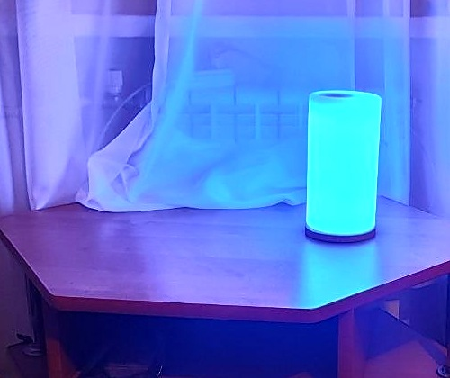

# Claude Code Status Lamp 🚦

Turn any **[WLED](https://github.com/wled/WLED)** lamp — including a re-flashed **[GyverLamp](https://github.com/AlexGyver/GyverLamp)** — into a physical status light for [Claude Code](https://claude.com/claude-code). The lamp changes color with what Claude is doing:

- 🔵 **Blue** — Claude is working
- 🟡 **Amber** — Claude needs your attention (permission / waiting for input)
- 🟢 **Green** — Claude finished the turn

It hooks into Claude Code's lifecycle events, so there's no polling and no extra service — just a tiny script that fires a one-line HTTP request to the lamp.

<!-- Add your photo here:  -->

## How it works

Claude Code [hooks](https://code.claude.com/docs/en/hooks) run a shell command on lifecycle events. Each event calls `lamp_status.py <state>`, which POSTs `{"ps": N}` to WLED's JSON API to apply a preset (a solid color):

```
UserPromptSubmit ──▶ lamp_status.py working    ──▶ WLED preset 1 (blue)
Notification     ──▶ lamp_status.py attention  ──▶ WLED preset 2 (amber)
Stop             ──▶ lamp_status.py done       ──▶ WLED preset 3 (green)
```

`lamp_status.py` is **fail-silent**: if the lamp is offline or on another network, the hook does nothing and never blocks Claude.

## Hardware

- Any ESP8266/ESP32 board driving WS2812B (or compatible) LEDs, running **WLED**.
- A **GyverLamp** (AlexGyver's addressable-LED matrix lamp) works great — just reflash it from stock firmware to WLED.
- Needs ≥4 MB flash and a **2.4 GHz** WiFi network on the same subnet as the machine running Claude Code.

## Setup

### 1. Flash WLED

Use the browser flasher at **[install.wled.me](https://install.wled.me/)** (Chrome/Edge). Pick the build for your chip (ESP8266 or ESP32), tick **Erase**, install. No Arduino IDE needed.

> **Reflashing a GyverLamp?** Connect to the controller board's **own** micro-USB (the case jack is often power-only), use a **data** USB cable (not charge-only), and install the **CP2102 / CH340** driver if no COM port appears.

### 2. Connect the lamp to 2.4 GHz WiFi

Join the `WLED-AP` network (password `wled1234`), open `http://4.3.2.1`, and enter your home WiFi.

> ⚠️ **The #1 gotcha.** ESP8266 is **2.4 GHz only** and does **not** reliably join **WiFi 6 (802.11ax)** access points. If the lamp won't connect:
> - select the **2.4 GHz** SSID (not a `*_5G` one);
> - in your router, set the 2.4 GHz band to **802.11 b/g/n** (disable WiFi 6 / "ax"). On **Xiaomi / Redmi** routers this is the web UI → **Settings → Wi-Fi settings → "WiFi 5 compatibility mode"**;
> - keep encryption on **WPA2-PSK** (not WPA3 / mixed).

### 3. Find the lamp's IP

Check your router's client list, try `http://wled.local`, or scan your subnet. Then pin it with a **DHCP reservation** so the address never changes.

### 4. Create the status presets

Run the setup script (replace with your lamp's IP):

```bash
python setup.py 192.168.1.50
```

…or in WLED upload [`presets.json`](presets.json) (Config → Security & Backup → Restore presets), …or create three **Solid**-color presets manually: `1` = blue, `2` = amber, `3` = green.

### 5. Set the LED count

WLED → **Config → LED Preferences** → set the LED count to your matrix size (e.g. **256** for a 16×16) and the data pin (a GyverLamp uses **GPIO2 / D4**). Otherwise only part of the lamp lights up. Set the current limit to match your power supply.

### 6. Install the hook script + hooks

- Put `lamp_status.py` somewhere stable. Set your lamp IP via the `WLED_IP` environment variable, or edit `LAMP_IP` at the top of the file.
- Merge the hooks from [`examples/settings-hooks.json`](examples/settings-hooks.json) into your Claude Code `~/.claude/settings.json`. **Merge** into the existing `hooks` object — don't overwrite it. Point each command at your `lamp_status.py` path and Python launcher.

### 7. Test

Submit a prompt → 🔵 blue. Claude finishes → 🟢 green. If nothing happens, run `/hooks` once (or restart Claude Code) so it reloads `settings.json`.

## Customization

- **Colors:** edit the RGB tuples in `setup.py`, or re-save presets in the WLED app.
- **Animated statuses:** a WLED preset can store any effect, not just a solid color — make "working" a breathing blue, "attention" a blink, etc. Just re-save the preset with an effect selected.
- **More states:** map other hooks (`PreToolUse`, `SubagentStop`, `StopFailure`) to extra presets.

## Troubleshooting

| Symptom | Fix |
|---|---|
| Lamp won't join WiFi | 2.4 GHz only **and** disable WiFi 6 on the router (see step 2) |
| Only part of the matrix lights | Set the correct LED count (step 5) |
| No COM port when flashing | Install CP2102/CH340 driver; use a **data** USB cable; plug into the board's own USB, not the case power jack |
| Hooks don't fire | Run `/hooks` or restart Claude Code to reload settings; verify the Python path in the command |
| IP changed, lamp stopped reacting | Set a DHCP reservation; update `WLED_IP` |

## Credits

- [WLED](https://github.com/wled/WLED) — the firmware doing all the heavy lifting.
- [GyverLamp](https://github.com/AlexGyver/GyverLamp) by AlexGyver — the lamp many of us reflashed.
- [Claude Code](https://claude.com/claude-code) — the agent whose mood we now watch on a lamp.

## License

[MIT](LICENSE).
